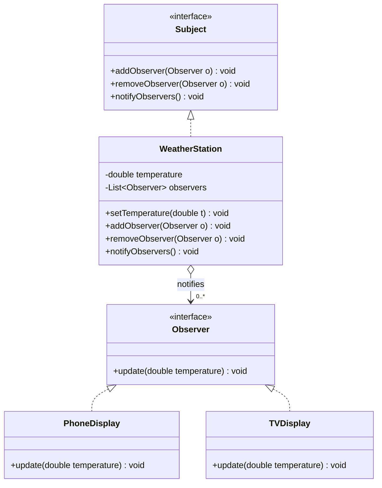

# Observer — UML

## Roles
| GoF role | Class(es) |
|----------|-----------|
| Subject / Publisher (interface) | `Subject` |
| Concrete Subject | `WeatherStation` |
| Observer / Subscriber (interface) | `Observer` |
| Concrete Observers | `PhoneDisplay`, `TVDisplay` |

## Key points
- `WeatherStation` keeps a `List<Observer>` (the `0..*` association) and, on `setTemperature()`, calls `notifyObservers()` to broadcast `update(...)` to every subscriber.
- It depends only on the `Observer` abstraction — **never** on `PhoneDisplay`/`TVDisplay` (DIP).
- Observers subscribe/unsubscribe **at runtime** via `addObserver`/`removeObserver`.
- **Push model** (shown): the subject sends data in `update(double)`. **Pull model**: `update()` takes no data and observers call `station.getTemperature()` themselves.
- New display = new `Observer` implementation, zero edits to the station (OCP).
