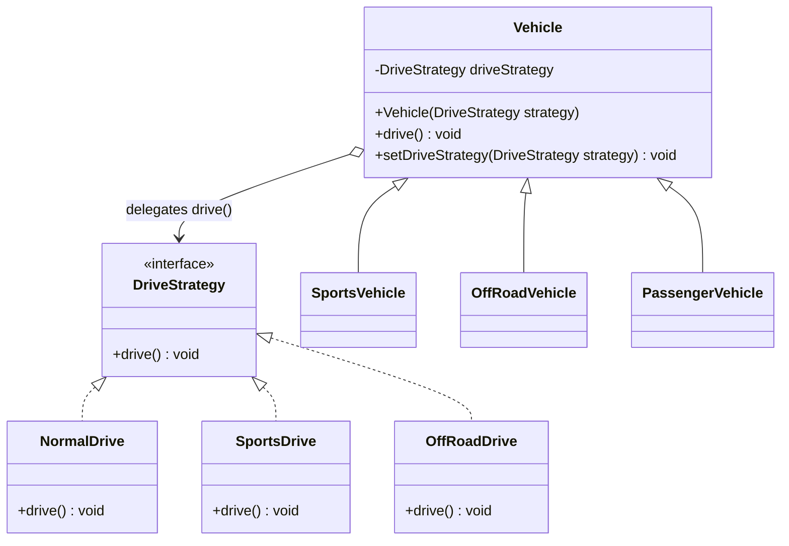

# Strategy — UML

## Roles
| GoF role | Class(es) |
|----------|-----------|
| Strategy (interface) | `DriveStrategy` |
| Concrete Strategies | `NormalDrive`, `SportsDrive`, `OffRoadDrive` |
| Context | `Vehicle` (and subtypes) |

## Key points
- `Vehicle` **holds a `DriveStrategy` field** (composition `o-->`) and `drive()` delegates to it — it does not implement driving itself.
- Because the algorithm is a field, `setDriveStrategy()` can swap it **at runtime** — the defining Strategy capability.
- Subclasses just supply a default strategy via `super(...)`; they no longer override `drive()`.
- New behavior = new `DriveStrategy` implementation, zero edits elsewhere (OCP).
