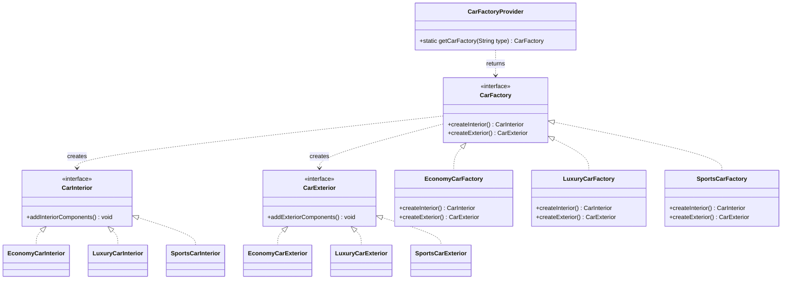

# Abstract Factory — UML

## Roles
| GoF role | Class(es) |
|----------|-----------|
| Abstract Products | `CarInterior`, `CarExterior` |
| Concrete Products | `Economy/Luxury/Sports` × `Interior/Exterior` |
| Abstract Factory | `CarFactory` |
| Concrete Factories | `EconomyCarFactory`, `LuxuryCarFactory`, `SportsCarFactory` |
| Factory Provider (optional) | `CarFactoryProvider` |

## Key points
- Each concrete factory produces a **whole consistent family** — `EconomyCarFactory`
  returns only Economy products, so mixing families (economy interior + luxury
  exterior) is impossible to express.
- The factory bundles **multiple** factory methods (`createInterior` + `createExterior`);
  that's the distinction from Factory Method, which has just one.
- New family = new products + one new factory, **zero edits** to existing code (OCP).
- The client depends only on the `CarFactory`/product interfaces (DIP).
