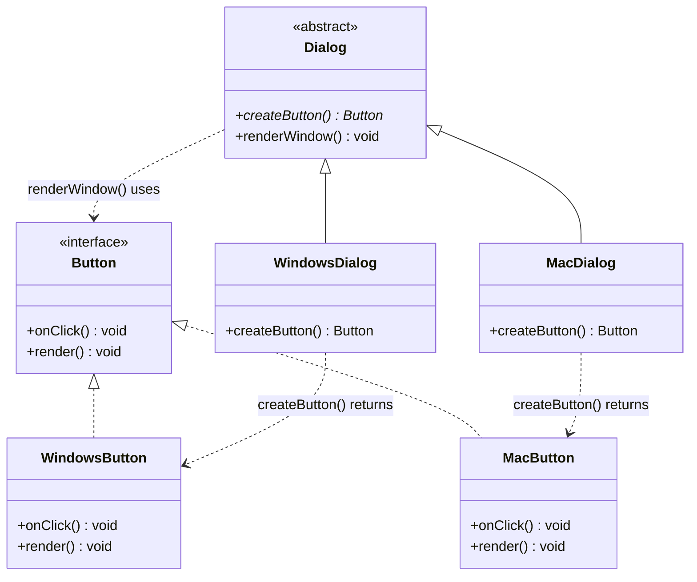

# Factory Method — UML

## Roles
| GoF role | Class(es) |
|----------|-----------|
| Product (interface) | `Button` |
| Concrete Products | `WindowsButton`, `MacButton` |
| Creator (abstract) | `Dialog` |
| Concrete Creators | `WindowsDialog`, `MacDialog` |

## Key points
- `createButton()` is the **factory method** (abstract) — subclasses decide which concrete product to instantiate.
- `renderWindow()` is concrete logic that depends only on the `Button` abstraction (DIP); it never names a concrete button.
- New platform = new Product + new Creator, **zero edits** to existing code (OCP).
