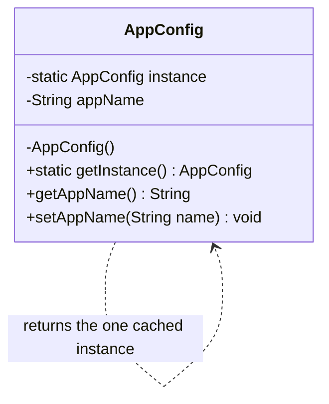

# Singleton — UML

## Roles
| GoF role | Class |
|----------|-------|
| Singleton | `AppConfig` |

## Key points
- **Private constructor** — blocks `new AppConfig()` from outside.
- **`private static instance`** — one slot for the whole class, caches the sole object.
- **`static getInstance()`** — lazy: creates on first call, returns the same object thereafter (`synchronized` keeps it thread-safe).
- The self-association is the essence: the class holds and hands out *itself*.
